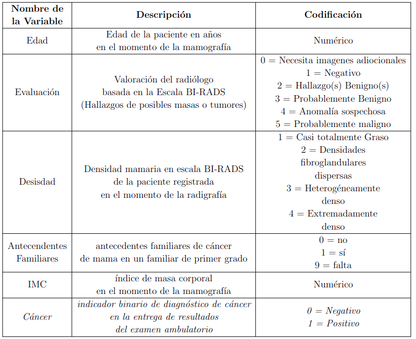

```{r setup, include=FALSE}
knitr::opts_chunk$set(echo = TRUE)
```

\tableofcontents

\newpage

# Introducción

La estructura del modelo bayesiano permite capturar las relaciones de dependencia que existe entre los atributos de los datos que se estudien, por medio de una distribución "posterior", por lo cual en este artículo veremos una aplicación en la rama de la salud, específicamente en casos de cáncer de mama, esto aplicando inferencia bayesiana por medio de un modelo logístico binario, para ver las probabilidades según un conjunto de datos conocidos de que $X$ mujer (hablando desde la parte biológica, abstrayendo todo concepto de género diferente) pueda ser diagnosticada con cáncer de mama (sin discriminación por tipo de cancer)

Más adelante veremos por medio de diagnósticos (la mayoría, por no decir todos) visuales, para un mejor entendimiento (cada uno de ellos explicados posteriormente) del modelo y si este nos ayuda a predecir el problema en cuestión, además veremos un cambio en las variables de respuesta por lo que veremos otros modelos del mismo tipo para una comparación entre ellos.

# Antecedentes

En base al software estadístico R versión 4.2.0, con la ayuda de los paquetes:

-   tidyverse
-   magrittr
-   janitor
-   readr
-   BayesFactor
-   bayesplot
-   brms
-   RStan

con las propiedades de RStan para la construcción del modelo logístico; cabe destacar que donde se corrieron los modelos no contaban con un gran poder computacional, por lo que los tiempos de ejecución eran muy largos.

La base de datos fue tomada del Instituto Nacional del Cáncer ([INC](https://www.bcsc-research.org/data/mammography_dataset/dataset_documentation)), donde recopilaron información de 20.000 mamografías digitales y 20.000 de proyección de película realizadas entre enero de 2005 y diciembre de 2008 de mujeres incluidas en el Consorcio de Vigilancia del Cáncer de Mama en las cuales encontramos las siguientes variables:

{width="65%"}
